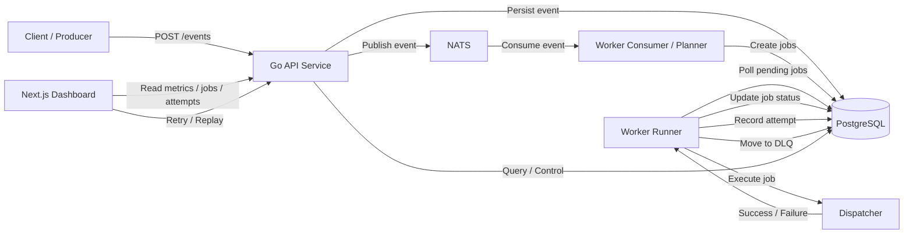

# RelayOps (Event-driven Workflow Platform)

Event-driven job processing system that converts incoming events into asynchronous workflows with retry, backoff, and dead-letter handling.

---

## Demo

Frontend: [http://localhost:3000](http://localhost:3000)

Backend: [http://localhost:8080](http://localhost:8080)

---

## What this project shows

* Event-driven system design (beyond CRUD)
* Asynchronous job processing with retry & backoff
* Failure handling via dead-letter queue (DLQ)
* Separation of concerns between ingestion, planning, and execution
* Observability (delivery attempts, metrics, replay)

---

## Key Features

* Accepts events via HTTP API
* Converts events into one or more jobs
* Processes jobs asynchronously via worker

Job execution supports:

* Retry with backoff
* Max attempts limit
* Dead-letter queue when retries exhausted
* Replay dead-lettered jobs
* Full execution history (`delivery_attempts`)

Dashboard shows:

* System metrics (events, jobs, attempts)
* Recent jobs and events
* Job detail with execution timeline
* Replay / retry controls

---

## Architecture

System follows an event-driven pipeline:


### Components

* **API (Ingestion Layer)**

  * Receives events
  * Stores event
  * Publishes message to NATS

* **Consumer (Planner)**

  * Listens to events
  * Converts event → jobs

* **Runner (Worker)**

  * Pulls pending jobs
  * Executes via dispatcher
  * Handles retry / DLQ logic

* **Dispatcher**

  * Channel-specific execution (email, webhook, etc.)
  * Isolated from core logic

* **Database**

  * `events` → source of truth
  * `jobs` → execution state
  * `delivery_attempts` → full history
  * `dead_letters` → failed jobs

---

## Design Decisions

* **NATS for decoupling ingestion and processing**

  * API does not block on execution
  * Workers can scale independently

* **Retry handled in worker (not API)**

  * Keeps HTTP layer simple
  * Centralized failure logic

* **Delivery attempts stored as append-only log**

  * Enables debugging and observability
  * Avoids overwriting execution history

* **Dead-letter queue instead of infinite retries**

  * Prevents stuck jobs
  * Allows manual recovery (replay)

* **Replay vs Retry**

  * Retry → within current lifecycle
  * Replay → revive a dead-lettered job

---

## Observability

System exposes:

* Metrics summary:

  * total events
  * pending jobs
  * succeeded jobs
  * dead-lettered jobs
  * total attempts

* Job detail:

  * execution history
  * errors per attempt
  * timestamps

---

## Tech Stack

Frontend: Next.js, React, Ant Design

Backend: Go (chi), PostgreSQL

Messaging: NATS

---

## Run Locally

```bash
docker compose up -d
cd backend && go run ./cmd/api
cd backend && go run ./cmd/worker
cd frontend && npm install && npm run dev
```

---

## Example Flow

1. Client sends event:

```json
{
  "event_type": "user.registered",
  "source": "auth-service"
}
```

2. System:

* stores event
* creates job `welcome_email`
* worker processes job

3. If failure:

* retries with backoff
* after max attempts → moves to dead letter

4. User can:

* inspect job
* replay job from dashboard

---

## Why this project matters

Most systems fail at:

* handling retries correctly
* dealing with partial failures
* debugging async workflows

This project demonstrates:

* controlled retry logic
* explicit failure handling
* traceable execution history

> Moving from synchronous CRUD → real distributed system thinking

